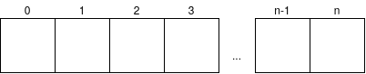

# Capítulo 1 - Escrevendo um algoritmo
Você precisa trocar uma lâmpada queimada em sua casa. Quais são os passos necessários para realizar esta troca?

Poderíamos pensar na seguinte sequência de passos: 1) pegar a escada; 2) colocar a escada abaixo do bocal; 3) subir na escada; 4) remover a lâmpada queimada do bocal; 5) colocar a nova lâmpada no bocal; 6) descer da escada e 7) testar a nova lâmpada apertando o interruptor.

Pode ser que você tenha pensado num passo-a-passo um pouco diferente do meu, e tudo bem com isso. Problemas similares são resolvidos de formas distintas por cada pessoa.

Assim, podemos dizer que os algoritmos são uma sequência de passos para resolver um problema, e nós fazemos isso todos os dias. A diferença aqui é que vamos utilizar um computador e a pseudo-linguagem Portugol (Português Estruturado) para criar algoritmos.

Se sua intenção é ser um programador não se preocupe. Se conseguir resolver problemas criando algoritmos com o Portugol, será fácil aprender uma linguagem de programação como Java, C, Python, JavaScript, etc.

A primeira atividade é instalar o [Portugol Studio](http://lite.acad.univali.br/portugol/). Esse ambiente vai nos ajudar nessa jornada para escrevermos nosso primeiro algoritmo.

Os subtópicos deste capítulo são os seguintes:
* [Variáveis](#variaveis)
* [Estrutura básica de um algoritmo](#estrutura-basica-de-um-algoritmo)
* [Declarando uma variável](#declarando-uma-variavel)
* [Modificando o conteúdo de uma variável](#modificando-o-conteudo-de-uma-variavel)
* [Escrevendo no console](#escrevendo-no-console)
* [Operadores de atribuição](#operadores-de-atribuicao)
* [Operadores aritméticos](#operadores-aritmeticos)
* [Lendo dados do usuário](#lendo-dados-do-usuario)
* [Constantes](#constantes)
* [Teste de mesa](#teste-de-mesa)

## Variáveis
Um dos propósitos de um programa de computador é manipular dados. Esses dados podem ser a idade de uma pessoa, seu nome, seu sexo, seu salário se ele pagou ou não a conta de energia, e assim por diante. Com esses dados podemos realizar operações, como calcular se o aluno é maior de idade, apresentar ao usuário do programa um relatório contendo os endereço para entrega de um produto, com base em seu tempo de contribuição calcular quanto tempo falta para aposentadoria e assim por diante. Para **guardar** esses dados o programa de computador utiliza o conceito de variáveis. A imagem a seguir ilustra a memória de computador como uma caixa dividida em compartimentos:

Em cada compartimento desse você pode guardar uma quantidade de dados, e para cada tipo de dado (explicação a seguir), é utilizado uma quantidade de desses compartimentos.

Cada **dado** pode ser classificado por um tipo, vejamos:
* Para guardar a quantidade de alunos precisamos de uma variável do tipo **inteiro**, pois só temos dados do tipo numérico inteiro, 0 (zero) alunos, 1 (um) aluno, 2 (dois) alunos;
* Para guardar o salário de um funcionário precisamos de uma variável do tipo **real**, pois temos valores com casas decimais, assim um funcionário poderia ter o salário de 1.200,60 (mil duzentos reais e sessenta centavos);
* Para guardar o sexo de um funcionário precisamos de variável do tipo **caracter**, pois podemos simplificar e dizer que 'F' representará o sexo feminino e 'M' representará o sexo masculino;
* Para guardar o nome de um aluno precisamos de mais que um caracter. Assim, utilizamos o tipo **cadeia** (de caracteres): "Emília Andrade", "Mariana Oliveira";
* Para guardar o dado que uma conta de energia foi paga podemos utilizar o tipo **logico**, que representa apenas dois estados: verdadeiro ou falso;

A tabela a seguir representa os tipos básicos de dados que podemos utilizar no Portugol.
<table class="table">
  <tr>
    <th>Tipo</th>
    <th>Explicação</th>
    <th>Exemplo</th>
  </tr>
  <tr>
    <td>Real</td>
    <td>valores numéricos reais</td>
    <td>18.39</td>
  </tr>
  <tr>
    <td>Inteiro</td>
    <td>valores numéricos inteiros</td>
    <td>10</td>
  </tr>
  <tr>
    <td>Caracter</td>
    <td>um caracter</td>
    <td>A</td>
  </tr>
  <tr>
    <td>Cadeia</td>
    <td>um conjunto de caracteres</td>
    <td>Rua das flores nº 1023</td>
  </tr>
  <tr>
    <td>Lógico</td>
    <td>pode assumir apenas verdadeiro ou falso</td>
    <td>verdadeiro</td>
  </tr>  
</table>

Então, se for necessário guardar a quantidade de parcelas de um veículo qual será o tipo de dado mais adequado?

🤔 Pense um pouco...

Devemos utilizar o tipo inteiro, pois a quantidade de parcelas é um número inteiro. Podemos ter 0 (zero) parcelas, podemos ter 2 (duas) parcelas, 30 (trinta) parcelas, mas não teremos meia parcela.

Agora responda qual o tipo de dado adequado para as seguintes situações:
* O preço de um produto
* A quantidade de um determinado produto
* A descrição de um produto
* Se o aluno foi aprovado ou reprovado
* Armazenar a temperatura em Celsius
* Armazenar a temperatura em Fahrenheit
* Uma letra do alfabeto
* O endereço de um funcionário

Respostas: << <a onclick="show('#var_tipo', this)">mostrar respostas</a>
<ul id="var_tipo" style="display: none">
	<li> Para guardar o preço de um produto precisamos de uma variável do tipo real, pois um produto pode custar R$ 10,50 (dez reais e cinquenta centatos).</li>
	<li> Para guardar a quantidade de um produto temos uma pegadinha, pois depende de que tipo de produto. Imagine que o produto vendido serão carros. Nesse caso podemos utilizar o tipo inteiro, pois não venderemos meio carro. Agora imagine que o produto vendido é carne, e nesse caso, podemos vender meio quilo de carne, e nesse caso o tipo de dado deve ser real.</li>
	<li> Para guardar a descrição de um produto precisamos de mais de um caracter, sendo mais adequado o tipo cadeia.</li>
	<li> Para guardar a informação que o aluno foi aprovado ou reprovado podemos utilizar o tipo lógico, pois teremos somente 2 situações, convencionando que verdadeiro será quando ele for aprovado e falso quando ele for reprovado.</li>
	<li> Para guardar as temperaturas precisamos de uma variável do tipo real, que serve para Celsius e Fahrenheit.</li>
	<li> Para guardar somente uma letra do alfabeto precisamos de uma variável do tipo caracter.</li>
	<li> Para guardar o endereço de um funcionário precisamos de vários caracteres, assim, o tipo que devemos utilizar é o cadeia.</li>
</ul>

## Estrutura básica de um algoritmo
Abra o Portugol Studio e crie um novo arquivo. Observe que o algoritmo criado já possui uma estrutura, existe uma palavra **programa** e abaixo dela é aberta uma '{' chave que é fechada no final do algoritmo. Observe também que há uma **funcao inicio()** que, da mesma forma, tem abaixo uma '{' chave que é fechada em seguida. Essas chaves representam o escopo e têm a função de limitar o que está dentro. Assim, visualmente é possível perceber que a **funcao inicio()** está dentro do **programa**.

programa
{
	funcao inicio()
	{
		// O seu código será digitado aqui		
	}
}


Cada instrução (comando) é escrito em uma linha.

Por ora você deve compreender que todo o código que iremos digitar ficará dentro da função **inicio**, que nada mais é uma função que é executada quando o programa é executado.

Outra coisa que precisamos esclarecer nesse momento são os comentários dentro do nosso código. Perceba que na linha 5 utilizamos duas barras '//' com o texto **O seu código será digitado aqui**. Essas duas barras indicam que a linha é um comentário e não será executado pelo Portugol Studio. Esse recurso é bem útil para auxiliar no entendimento do código descrevendo algo que seja de entendimento complexo.

## Declarando uma variável
Agora que você já sabe o que é uma variável e conhece a estrutura básica de um algoritmo vamos aprender a declará-las, ou seja, disponibiliza-las para que possam receber conteúdo. Dentro da função inicio vamos declarar algumas variáveis:

programa
{
	funcao inicio()
	{
		cadeia nome
		cadeia endereco
		caracter sexo_do_aluno
		inteiro idade
		real salario
		logico realizado
	}
}


Por convenção vamos nomear as variáveis iniciando com uma letra minúscula e contendo somente letras (maiúsculas ou minúsculas), números ou os caracteres _ (underline) ou - (traço). Também é importante utilizar um nome que identifique o seu conteúdo. **salario** é mais adequado para uma variável para armazenar um salário do que **slrio**, por exemplo.

Qual dos nomes a seguir são corretos para nomear variáveis. Caso não seja defina um novo nome:
a) nome do cliente  
b) Salario  
c) IDADE  
d) idade  
e) nomeDaMãe  
f) 1telefone  
g) 2telefone  
h) Cargo  

Respostas: << <a onclick="show('#var_nomear', this)">mostrar respostas</a>
<ul id="var_nomear" style="display: none">
	<li>a) nome-do-cliente ou nome_do_cliente ou nomeDoCliente</li>
	<li>b) salario</li>
	<li>c) idade</li>
	<li>d) Nome adequado!</li>
	<li>e) nomeDaMae</li>
	<li>f) telefone1</li>
	<li>g) telefone2</li>
	<li>h) cargo</li>
</ul>

 Existem alguns estilos para nomeação de variáveis e funções. Com o CamelCase podemos criar nomes de variáveis com palavras compostas, onde a letra inicial de cada palavra é maiúscula, como por exemplo: SalarioBruto, SalarioLiquido e NomeDaMae. Uma forma de empregar o CamelCase em nomes de variáveis e funções é iniciar com a primeira palavra minúscula, veja: salarioBruto, salarioLiquido e nomeDaMae. Com o snake_case utilizamos o caracter underline para criar nomes de variáveis e funções com palavras compostas, ficando assim: salario_bruto, salario_liquido e nome_da_mae

Outro aspecto importante a se considerar é o **case sensitive**: a maioria das linguagens diferencia maiúsculas e minúsculas. Assim, idade é diferente de Idade ou IDADE ou iDaDe. 

## Modificando o conteúdo de uma variável
Após declarar uma variável provavelmente você vai querer modificar o conteúdo dela (que a princípio não tem nada). Para fazermos isso basta chamar o nome da variável e atribuir um conteúdo:

programa
{
	funcao inicio()
	{
		cadeia nome
		nome = "Maria da Silva"

		caracter sexo
		sexo = 'F'

		inteiro idade
		idade = 12

		real salario
		salario = 2400.45

		logico realizado
		realizado = verdadeiro
	}
}


Vamos ler o que está codificado:
* Linha 5: é declarada uma variável nome do tipo cadeia. A variável nome **recebe** o valor Maria da Silva na linha 6.
* Linha 8: é declarada uma variável sexo do tipo caracter. A variável sexo **recebe** o valor F na linha 10.
* Linha 10: é declarada uma variável idade do tipo inteiro. A variável idade **recebe** o valor 12 na linha 11.
* Linha 13: é declarada uma variável salario do tipo real. A variável salario **recebe** o valor 2400.45 na linha 14.
* Linha 16: é declarada uma variável realizado do tipo logico. A variável realizado **recebe** o valor verdadeiro na linha 17.

Mas perceberam que o conteúdo "Maria da Silva" da variável nome está entre aspas duplas? Pois bem, dependendo do tipo de variável o conteúdo deve seguir uma norma, vejamos:

* Para variáveis do tipo **cadeia** o conteúdo deverá estar entre **aspas duplas**.
* Para variáveis do tipo **caracter** colocamos o caracter entre **aspas simples**.
* Para variáveis do tipo **inteiro** basta atribuir um **valor numérico inteiro**.
* Para variáveis do tipo **real** atribuímos um valor do tipo real, mas precisamos nos atentar que as **casas decimais são separadas por pontos**.
* Para variáveis do tipo **logico** só temos dois valores possíveis: **verdadeiro** ou **falso**.

Em determinadas situações além de declarar a variável, e assim reservar um espaço na memória para ela, necessitamos atribuir um valor imediatamente. Imagine que você está criando um programa para uma conta bancária e quer que o saldo inicialmente seja 0 (zero) e o limite seja 1.000 (mil).

programa
{
	funcao inicio()
	{
		cadeia nome_do_cliente
		real saldo = 0.0
		real limite = 1000.00
	}
}


Veja que a variavel saldo foi declarada e já recebeu o valor 0, e a variável limite foi declarada com o valor 1.000. Enquanto a variável nome_do_cliente foi declarada mas não recebeu nenhum valor.

Atribua valores as seguintes variáveis:
a) cadeia nome =  
b) inteiro qtd =  
c) logico realizado =  
d) caracter sexo =  
e) real salario =  
f) cadeia cpf =  
g) inteiro cpf =  
h) real qtd =  
i) cadeia endereco =  
j) real valor_unitario =  
k) real valor_total =  
l) inteiro idade =  

Respostas: << <a onclick="show('#var_atribuir', this)">mostrar respostas</a>
<ul id="var_atribuir" style="display: none">
	<li>a) nome = "Emília Andrade"</li>
	<li>b) qtd = 10</li>
	<li>c) realizado = falso</li>
	<li>d) sexo = 'M'</li>
	<li>e) salario = 2450.00</li>
	<li>f) cpf = "450.432.456-90"</li>
	<li>g) cpf = 45043245690</li>
	<li>h) qtd = 15.4</li>
	<li>i) endereco = "Avenida do Contorno nº 1010"</li>
	<li>j) valor_unitario = 13.20</li>
	<li>k) valor_total = 30.00</li>
	<li>l) idade = 18</li>

## Escrevendo no console
O Portugol Studio tem uma área para visualizarmos a saída da execução dos nossos algoritmos chamada de console. Se você executar o algoritmo a seguir o que irá acontecer?

programa
{
	funcao inicio()
	{
		inteiro idade
		idade = 12
	}
}


A variável idade foi declarada e, em seguida, teve 12 como valor atribuído. O resultado da execução no console foi algo assim:

Programa finalizado. Tempo de execução: 3 milissegundos.


Mas na maioria dos casos você vai querer que o algoritmo informe ao usuário alguma informação, certo? No caso do nosso algoritmo queremos que a idade declarada seja impressa. Para isso vamos utilizar o comando **escreva()**:

programa
{
	funcao inicio()
	{
		inteiro idade
		idade = 12
		escreva(idade)
	}
}


A saída do console será:  

12


Mas 12 o que? Não é muito informativo, certo?

Pois bem, além de utilizar o comando escreva para imprimir o conteúdo de uma variável podemos utiliza-lo para escrever algum texto informativo, e **concatena-lo** com variáveis utilizando o operador **+**:

programa
{
	funcao inicio()
	{
		inteiro idade
		idade = 12
		escreva("Programa de cálculo")
		escreva("A idade do aluno é " + idade)
	}
}


Agora a saída do console será a seguinte:  

Programa de cálculo
A idade do aluno é 12


Na linha 8 além do texto informativo, que é uma **cadeia**, e assim precisamos coloca-lo entre aspas duplas, estamos concatenando o valor da variável idade, que é 12. Agora fica claro para o usuário do que se trata o programa.

## Operadores de atribuição
Quando uma variável **recebe** um valor com o operador **=** estamos fazendo uma atribuição. Há outras operações de atribuição, como o incremento e o decremento:

programa
{
	funcao inicio()
	{
		inteiro idade = 12
		idade++
		escreva(idade)

		inteiro contador = 10
		contador--
		escreva(idade)
	}
}


Na linha 6 o conteúdo da variável idade foi incremento em 1, passando a valer 13. Na linha 10 o conteúdo da variável contador foi decrementando em 1, passando a valer 9.

Em outras palavras estamos dizendo que: a idade recebe o próprio valor mais um; o contador recebe o próprio valor menos um. O código a seguir faz a mesma coisa:

programa
{
	funcao inicio()
	{
		inteiro idade = 12
		idade = idade + 1
		escreva(idade)

		inteiro contador = 10
		contador = contador - 1
		escreva(contador)
	}
}


Também podemos utilizar atribuições para simplificar nosso código. Imagine que o salário foi reajustado em R$ 200,00:

programa
{
	funcao inicio()
	{
		real salario = 1400.00
		salario += 200.00
	}
}


A leitura da linha 6 é que a variável salário foi incrementada em 200. Uma outra forma de fazer isso seria assim:

programa
{
	funcao inicio()
	{
		real salario = 1400.00
		salario = salario + 200.00
	}
}


Agora precisamos dar desconto de 5% no preço de um produto:

programa
{
	funcao inicio()
	{
		real preco = 30
		preco -= (preco * 0.05)
	}
}


Isso é equivalente a:

programa
{
	funcao inicio()
	{
		real preco = 30
		preco = preco - (preco * 0.05)
	}
}


## Operadores aritméticos
Com as variáveis do tipo inteiro e real podemos realizar as operações aritméticas básicas: somar, subtrair, multiplar e dividir.
<table>
	<tr>
		<th>Operação</th>
		<th>Símbolo</th>
	</tr>
	<tr>
		<td>adição</td>		
		<td>+</td>
	</tr>
	<tr>
		<td>subtração</td>
		<td>-</td>
	</tr>
	<tr>
		<td>multiplicação</td>
		<td>*</td>
	</tr>
	<tr>
		<td>divisão</td>
		<td>/</td>
	</tr>
</table>

Assim como na matemática as operações de divisão e multiplicação tem prioridade sobre as operações de somar e substrair.  
6 + 2 * 3  
Será executada a multiplicação 2 * 3 e o seu resultado será somado com 6, com valor final de 12.

Também podemos utilizamos parênteses para modificação da ordem das operações:  
(6 + 2) * 3  
Primeiro será realiza a soma 6 + 2 e o seu resultado será multiplicado por 3, com valor final de 24.

Na matemática colocamos mais níveis através de '[' colchetes e '{' chaves. Aqui nós utilizamos os parênteses:  
(((6 + 2) * 3) / 2)  
Primeiro será realiza soma 6 + 2, resultando em 8, que será multiplicado por 3, resultando em 24, que então será divido por 2, resultando em 12.

As variavéis podem receber, além de valores de outras variáveis, expressões artiméticas:

programa
{
	funcao inicio()
	{
		real salario
		real vale_alimentacao = 250.00
		
		salario = 2350.50
		salario = salario + vale_alimentacao
		vale_alimentacao = 250.00 * 1.2
	}
}


Uma variável **salario** foi declarada como tipo real. Também declaramos uma variável **vale_alimentacao** recebendo o valor 250.00. Em seguida, a variável salario recebeu o valor 2350.50. Finalmente, a variável salario recebeu o prório conteúdo, ou seja, 2350.50 somando com o conteúdo da variável vale_alimentacao (250.00), resultando em 2600.50. Por fim, reajustamos o valor da variável vale_alimentacao em 20%.

## Lendo dados do usuário
Pode ser que você queira que o próprio usuário informe os valores de uma variável. Faz sentido? Imagine que você está desenvolvendo um algoritmo para que o valor de uma conta na lanchonete seja dividido em partes iguais entre seus amigos. Além do valor da conta, precisamos da quantidade de amigos. Para ler valores informados pelo usuário utilizamos o comando **leia()**, veja:

programa
{
	funcao inicio()
	{
		inteiro quantidade_amigos
		real valor_conta
		real valor_por_amigo

		escreva("Informe o valor da conta: ")
		leia(valor_conta)
		
		escreva("Informe a quantidade de amigos: ")
		leia(quantidade_amigos)
		
		valor_por_amigo = valor_conta / quantidade_amigos
		escreva("Cada amigo deverá pagar R$ " + valor_por_amigo)
	}
}


Observe nas linhas 10 e 13 utilizamos o comando **leia()** para ler algum valor que o usuário do programa irá digitar e, em seguida, atribuir esse valor a variável informada ao comando. Na linha 15 realizamos o cálculo do valor por amigo dividindo o totalda conta pelo quantidade de amigos, e na linha 16 imprimimos quanto cada amigo deverá pagar.

## Constantes
Há determinados dados que não devem mudar durante a execução de um algoritmo. O número pi tem o valor 3,1415 e não muda. Ou você pode determinar que um determinado dado não muda durante a execução do algoritmo. Para garantir que estes valores não alterem durante a execução do algoritmo os declaramos como constantes:

programa
{
	funcao inicio()
	{
		const real PI = 3.1415
	}
}


Por convenção declaramos as constantes em caixa alta (todas as letras maiúsculas).

Uma variável pode recebe o valor de uma constante. O algoritmo a seguir calcula a área do círculo com base no valor do raio informado pelo usuário e pelo número pi:

programa
{
	funcao inicio()
	{
		const real PI = 3.1415
		real raio
		real area

		escreva("Informe o raio do círculo: ")
		leia(raio)

		area = PI * (raio * raio)

		escreva("A área do círculo é " + area)		
	}
}


## Teste de mesa
Uma forma de verificar o que está acontecendo com os valores das variáveis durante a execução do algoritmo é utilizando um teste de mesa. Você pode fazê-lo em uma folha de caderno, mas no nosso caso, o Portugol Studio disponibiliza uma área para isso.
<!-- Colocar um GIF -->

