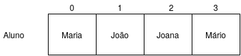
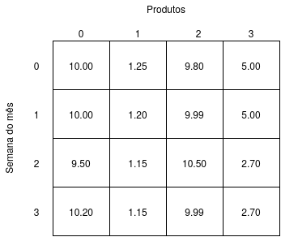

# Arranjos
Pense em um cadastro de alunos de uma escola, no qual você precisa informar nome, sexo, endereço, telefone e idade. A princípio o código a seguir seria suficiente para armazenar dados de um aluno:

cadeia nome
caracter sexo
cadeia endereco
cadeia telefone
inteiro idade


Mas estamos falando de um cadastro de aluno**s**, ou seja, precisamos de mais variáveis para armazenar todos os nomes dos alunos, todos os sexos dos alunos, todos os endereço, certo?. Uma solução possível seria criar uma variável nome para cada aluno que quisermos armazenar, uma variável sexo para cada aluno, e assim por diante:

cadeia nome1, nome2, nome3, nome4
caracter sexo1, sexo2, sexo3, sexo4
cadeia endereco1, endereco2, endereco3, endereco4


Pense no quão complexo seria implementar um algoritmo para ler 30 dados de alunos. Teríamos 30 variáveis para armazenar nomes, isso sem pensarmos no código para leitura e escrita desses dados. Mais 30 variáveis para o endereço. Ou seja, 30 variáveis para cada dado.

Nesses casos devemos utilizar **arranjos**, que nada mais são do que grupos de variáveis. Veja a imagem a seguir e observe que um arranjo é divido em uma determinada quantidade de "caixinhas", onde em cada caixinha dessas podemos armazenar um aluno.

Cada divisão do arranjo possui uma posição e um conteúdo, sendo estes de mesmo tipo.

Podemos implementar o seguinte código para definir um arranjo que poderá armazenar até 30 nomes de alunos:

cadeia nomes[30]


Entre os colchetes temos a quantidade de nomes que podemos armazenar na variável nome.

Os arranjos de **1 (uma) dimensão** são denominados **vetores**, e os arranjos com **mais de uma dimensão** são denominados **matrizes**.

## Vetores
Os vetores, e também as matrizes, possuem o mesmos tipos básicos disponíveis no Portugol Studio: caracter, cadeia, inteiro, real e logico. Assim, podemos declarar os seguintes vetores com o seu respectivo tamanho:

caracter    sexos[5]
cadeia      nomes[5]
inteiro     idades[5]
real        salarios[5]


Para atribuir valores a um vetor basta determinar a posição que será utilizada para armazena-lo:

nomes[0] = "Maria Oliveira"
nomes[1] = "Emília Santos"
nomes[2] = "Tereza Andrade"
nomes[3] = "José Camargo" 
nomes[4] = "Sara Maia"


Assim:
* O vetor nomes na posição **0** recebe o valor "Maria Oliveira".
* O vetor nomes na posição **1** recebe o valor "Emília Santos".
* O vetor nomes na posição **2** recebe o valor "Tereza Andrade".
* O vetor nomes na posição **3** recebe o valor "José Camargo".
* O vetor nomes na posição **4** recebe o valor "Sara Maria".

Um vetor é acessado a partir da posição 0 (zero). Isso significa que um vetor com 30 posições será acessado a partir da posição 0, indo até a posição 29. As regras de atribuição de valores seguem as mesmas normas das variáveis, por isso, no exemplo acima os nomes estão entre aspas duplas, pois são do tipo cadeia.

Uma posição do vetor comporta-se como variável normal, podendo receber valor direto do usuário ou tendo sendo valores impressos na tela:

// Lendo um nome para a posição 4 do vetor nomes
leia(nomes[4])

// Escrevendo o valor da posição 4 do vetor nomes
escreva("O nome da posição 4 é " + nomes[4])


Para imprimir ou informar valores para todas as posições de um vetor podemos percorre-lo com o laço de repetição **para**:

// Lendo valores informados pelo usuário para dentro do vetor
para (inteiro i = 0 i < 10; i++){
    escreva("Informe o " + i + " nome: ")
    leia(nomes[i])
}

// Imprimindo todo o conteúdo do vetor
para (inteiro i = 0; i < 10; i++){
    escreva(nomes[i])
}


Crie vetores para armazenar:
<ul>
    <li>a) O telefone de 5 contatos</li>
    <li>b) O nome da mãe de 6 alunos </li>
    <li>c) O preço de 4 produtos</li>
    <li>d) Alunos de uma turma </li>
</ul>

Respostas: << <a onclick="show('#criar_vetores', this)">mostrar respostas</a>
<ul id="criar_vetores" style="display: none">
<li>a) cadeia telefones[5]</li>
<li>b) cadeia nomes_maes[6]</li>
<li>c) real preco[4]</li>
<li>d) inteiro qtd_alunos[10]</li>
</ul>

Utilize laços de repetição para percorrer e ir preenchendo, e em seguida, imprimindo os dados dos vetores criados.

Respostas: << <a onclick="show('#implementar_vetores', this)">mostrar respostas</a>


// Lendo valores para o vetor telefone[5]
for (inteiro i = 0; i < 5; i++){
    escreva("Informe o " + i + " telefone: ")
    leia(telefones[i])
}

// Escrevendo os valores para o vetor telefones[5]
for (inteiro i = 0; i < 5; i++){
    escreva("Telefone " + i + ": " + telefones[i])
}

// Lendo valores para o vetor nomes_maes[6]
for (inteiro i = 0; i < 6; i++){
    escreva("Informe o " + i + " nome da mãe: ")
    leia(nomes_maes[i])
}

// Escrevendo os valores para o vetor nomes_maes[6]
for (inteiro i = 0; i < 6; i++){
    escreva("Nome da mãe " + i + ": " + nomes_maes[i])
}

// Lendo valores para o vetor precos[4]
for (inteiro i = 0; i < 4; i++){
    escreva("Informe o " + i + " preço: ")
    leia(precos[i])
}

// Escrevendo os valores para o vetor precos[4]
for (inteiro i = 0; i < 4; i++){
    escreva("Preço " + i + ": " + preço[i])
}

// Lendo valores para o vetor qtd_alunos[10]
for (inteiro i = 0; i < 10; i++){
    escreva("Informe a quantidade de alunos da turma " + i)
    leia(qtd_alunos[i])
}

// Escrevendo os valores para o vetor qtd_alunos[10]
for (inteiro i = 0; i < 10; i++){
    escreva("A turma " + i + " têm " + qtd_alunos[i] + " alunos.")
}


Assim como na declaração de uma variável podemos atribuir dados, na declaração de um vetor também podemos fazer o mesmo:

caracter dna = {'A', 'C', 'G', 'T'}
inteiro sorteio = {8, 11, 13, 28, 39, 40}


## Matrizes
As matrizes são arranjos com mais de uma dimensão. Uma forma fácil é pensar uma tabela, onde temos linhas e colunas, conforme podemos ver na figura a seguir:

Essa matriz com 2 dimensões nos ajuda a resolver uma série de problemas. Por exemplo, poderíamos querer armazenar a variação de preços de produtos durante determinado período de tempo. Poderíamos determinar que a cada coluna representa um produto e cada linha representa o valor deste produto em cada semana.

Mas a matriz não se limita a 2 dimensões, ele pode ter 3, 4 ou a quantidade que você precisar de dimensões. Uma forma é pensar em um cubo, onde temos linhas, colunas e profundidade.

Ao declarar uma matriz precisamos informar a quantidade de posições em cada dimensão. Veja esse exemplo de uma matriz com 2 (duas) dimensões:

inteiro matriz[2][3]


Declaramos uma matriz de 2 linhas e 3 colunas. As posições para armazenar valores desta matriz são as seguintes:

matriz[0][0] // Primeira linha e primeira coluna
matriz[0][1] // Primeira linha e segunda coluna
matriz[0][2] // Primeira linha e terceira coluna
matriz[1][0] // Segunda linha e primeira coluna
matriz[1][1] // Segunda linha e segunda coluna
matriz[1][2] // Segunda linha e terceira coluna


Podemos percorrer essa matriz informando ou lendo os seus valores. Para isso, precisamos de um laço de repetição para cada dimensão da matriz, veja:

// Primeiro vamos percorrer cada linha

// Vamos de 0 até 1 (2 linhas)
para (inteiro i = 0; i < 2; i++){

    // E em cada linha percorremos as colunas
    // Vamos de 0 até 2 (3 colunas)
    para (inteiro z = 0; i < 3; z++){
        
        escreva("Informe o valor da posição [" + i + "][" + z + "]")
        leia(matriz[i][z])
    }
}

// Imprindo os valores da matriz
para (inteiro i = 0; i < 2; i++){
    para (inteiro z = 0; i < 3; z++){
        escreva(matriz[i][z])
    }
}


